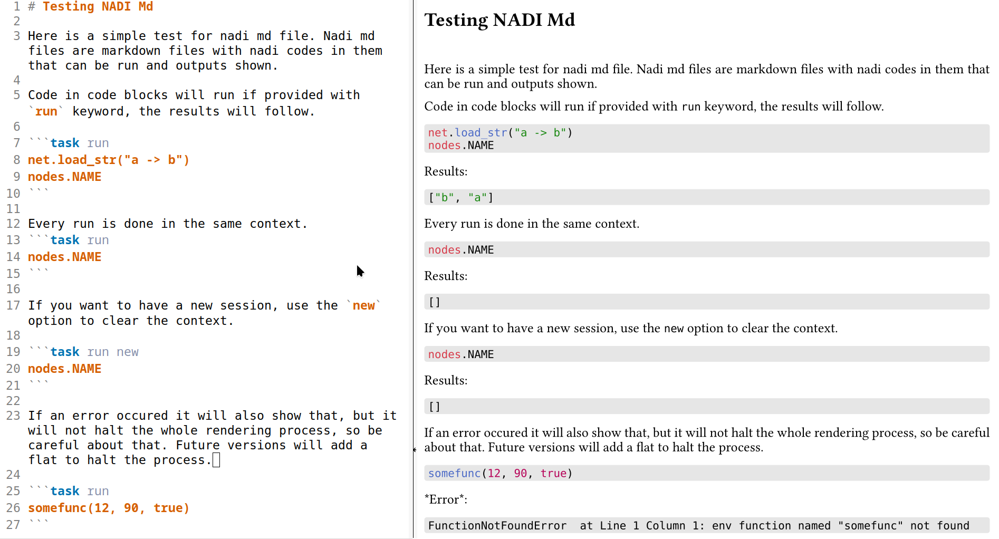

# Nadi Md to Typst Converter

This program parses a Markdown file with Nadi Tasks and executes them and renders them as a Typst (or a markdown) file.

You can compile it with `typst` compiler to generate PDF, HTML, SVG, and PNG.

The screenshot below shows an output PDF (right) side by side with the Markdown file used to generate it on left.



The commands used to generate this file is:

```bash
cargo run -- test.md -p pre.typ 
typst compile test.typ
```

The `pre.typ` contains come prelude for the `typst` file to have a better rendering as well as syntax highlighting for `nadi` syntax.
